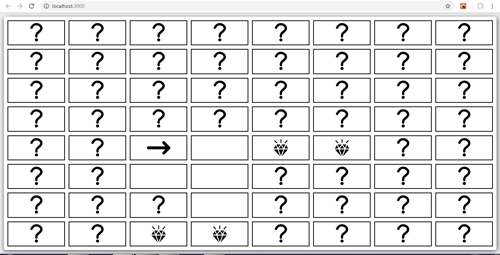
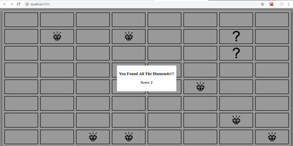

# diamondSweeper
A short and simple game built with React

## Steps to run the project (Development Mode) :
1. `npm install`
2. `npm run dev`

## Steps to build an optimized Prod bundle with minifications:
`npm run build`

**note:** The homepage property in the package.json file should be modified accordingly, for the build to work properly.

## Assumptions Made:
1. IE is not to be supported.
2. App will be run on latest versions of modern browsers.

## Libraries Used:
React

## UI Layout:
1. Fully Responsive.
2. Built using CSS Grids.

## Screenshts
### Gameplay

### Winning Scenario

